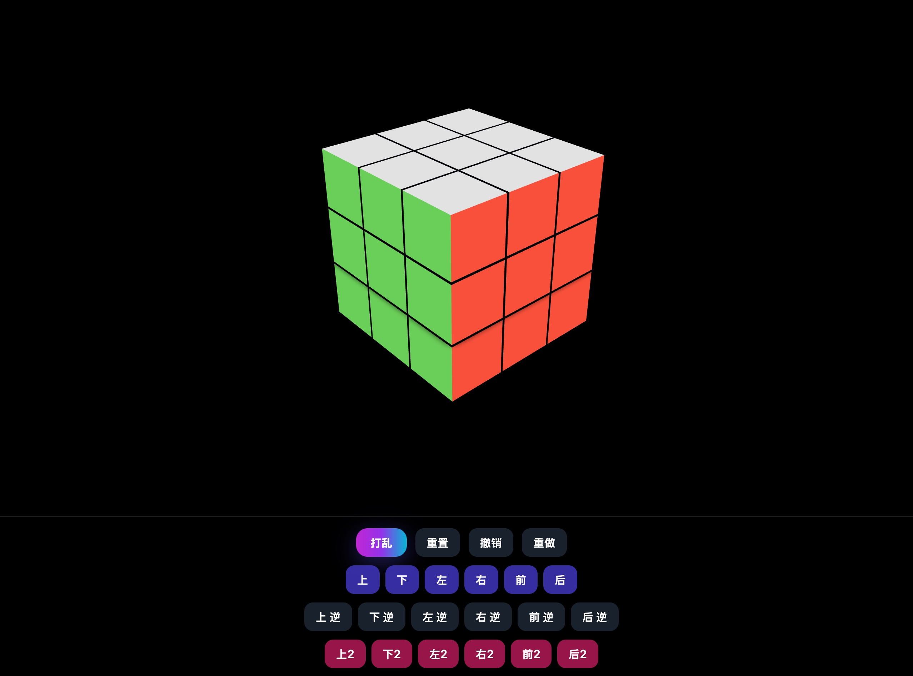

# Rubik's Cube Web（React + Three.js）

一个基于 React Three Fiber 的 3D 魔方可视化与交互项目。支持面旋转、撤销/重做、打乱、按步骤动画复原，界面为中文，开箱即用地部署到 GitHub Pages。

## 功能特性
- 交互操作：
  - 打乱、重置、撤销、重做
  - 面部快捷旋转（上/下/左/右/前/后，以及逆时针、180°）
  - 重置为“按步骤回放”的动画复原
- 视觉与交互：
  - OrbitControls（鼠标拖拽旋转视角，滚轮缩放）
  - Framer Motion 过渡动画、半透明磨砂 UI
- 历史管理：
  - 完整的 undo/redo 堆栈，修复了 redo 清空问题
- 构建与部署：
  - 基于 Vite 的快速开发与构建
  - 已配置 GitHub Actions，自动部署到 GitHub Pages
  - 自动适配子路径（/仓库名/）与用户主页仓库（owner.github.io）的资源 base

## 技术栈
- React 18
- @react-three/fiber + three.js
- @react-three/drei（辅助控件，如 OrbitControls/Stage 等）
- framer-motion
- Tailwind CSS
- Vite

## 本地开发
要求：Node.js ≥ 18 与 pnpm

```bash
pnpm install
pnpm dev
```
启动后，按照终端提示在浏览器中访问本地地址（一般为 http://localhost:5173/ 或相近端口）。

## 构建与预览
```bash
pnpm build
pnpm preview
```
- 构建产物输出到 `dist/`
- `pnpm preview` 会启动本地静态服务器以预览构建结果

## 部署到 GitHub Pages（已内置工作流）
项目已包含 GitHub Actions 工作流文件：`.github/workflows/deploy.yml`

步骤：
1. 在 GitHub 新建一个仓库（例如 `rubiks-cube-web`）
2. 推送代码到仓库的 `main` 分支：
   ```bash
   git init
   git add .
   git commit -m "chore: init"
   git branch -M main
   git remote add origin https://github.com/<你的GitHub用户名>/<你的仓库名>.git
   git push -u origin main
   ```
3. 在 GitHub 仓库中打开 Settings -> Pages，将 Source 选择为“GitHub Actions”（默认即可）
4. 打开 Actions 标签页，等待“Deploy to GitHub Pages”工作流构建并部署成功
5. 访问地址：
   - 如果仓库名为 `<用户名>.github.io`：访问 `https://<用户名>.github.io/`
   - 否则：访问 `https://<用户名>.github.io/<仓库名>/`

说明：
- `vite.config.ts` 已根据 `GITHUB_REPOSITORY` 自动设置 base：
  - 用户/组织主页仓库（`owner.github.io`）使用 `/`
  - 其他仓库使用 `/<repo>/`
- `index.html` 附带一个轻量回退脚本，尽量避免在子路径刷新导致的空白页（仅容错，不影响正常使用）

## 常见问题
- 访问 404 或静态资源 404：
  - 确认仓库 Settings -> Pages 的 Source 已选择 GitHub Actions
  - 稍等几分钟，等待 Actions 完成
  - 仓库名变更后，建议重新推送触发构建
- 自定义域名：
  - 到 Settings -> Pages 里绑定自定义域名；或
  - 在项目中新增 `public/CNAME` 文件（内容为你的域名），构建时会被带入 `dist/`

## 交互说明
- 底部控制条：
  - 打乱：随机执行若干步（默认 25 步）
  - 重置：按历史步骤逆向回放，动画复原
  - 撤销/重做：逐步回退/重做历史动作
- 面部快捷按钮：
  - 上/下/左/右/前/后，对应 U/D/L/R/F/B
  - “逆”表示逆时针（如 U' -> 上 逆），“2”表示 180°（如 U2 -> 上2）
- 视角操作：
  - 鼠标左键拖拽：旋转视角
  - 滚轮：缩放

## 项目结构
```
.
├── .github/workflows/deploy.yml   # GitHub Pages 自动部署工作流
├── src/                           # 源码
│   ├── components/                # 组件（Cube、UI、Controls）
│   ├── App.jsx                    # 页面入口
│   └── main.jsx                   # 应用入口
├── vite.config.ts                 # Vite 配置（含 GitHub Pages base 逻辑）
├── index.html                     # 模板（含轻量回退脚本）
├── package.json                   # 脚本与依赖
└── pnpm-lock.yaml
```

## 截图与演示
- 截图：

  

- 演示视频（.mov）：

  <video src="./cube.mov" controls width="640" preload="metadata"></video>

  如果无法内嵌播放，可直接下载或在仓库页面中查看： [下载/查看 cube.mov](./cube.mov)

## 许可
本项目使用 Apache License 2.0。详见根目录的 LICENSE 文件。